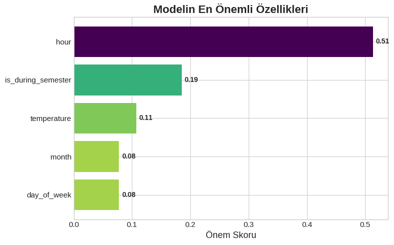

# 🏋️ Gym Kullanım Tahmin Sistemi



---

## 💡 Proje Hakkında
Bu proje, **makine öğrenmesi** kullanarak spor salonunun günlük yoğunluğunu tahmin etmeyi sağlar.  
Kullanıcıdan aldığı verilerle (hafta günü, saat, sıcaklık vb.) salonun doluluk oranını öngörür.

---

## ⚙️ Kullanılan Teknolojiler
- **Backend:** FastAPI  
- **Frontend:** HTML, CSS, JavaScript  
- **ML Modeli:** Scikit-Learn  
- **Veri İşleme:** Pandas  
- **Şablonlama:** Jinja2  

---

## 📝 Kurulum

1. Öncelikle Python ortamınızı hazırlayın (3.10+ önerilir).  
2. Proje klasörüne girin ve gerekli kütüphaneleri yükleyin:

```bash
pip install -r requirements.txt
requirements.txt içeriği:

ini
Kodu kopyala
scikit-learn==1.7.0
pandas==2.3.0
fastapi==0.115.12
uvicorn==0.34.3
Jinja2==3.1.6
python-multipart==0.0.20
Uygulamayı başlatın:

bash
Kodu kopyala
uvicorn app:app --reload
Tarayıcınızdan http://127.0.0.1:8000 adresine giderek uygulamayı görüntüleyebilirsiniz.

🖥️ Kullanım
Form üzerinden hafta günü, saat, sıcaklık, ay gibi bilgileri girin.

Model, spor salonunun tahmini yoğunluğunu size gösterecektir.

Önemli özelliklerin etkisini görselleştirilmiş grafiklerle takip edebilirsiniz.

📊 Özellikler
Kullanımı kolay ve interaktif arayüz

Makine öğrenmesi ile canlı tahminler

Önemli özelliklerin görselleştirilmesi

Hızlı ve hafif backend

📌 Dosyalar
app.py → FastAPI backend

templates/ → HTML şablonları

static/ → CSS ve JS dosyaları

model.pkl → Eğitilmiş ML modeli

GYM.png → Proje görseli

requirements.txt → Gerekli kütüphaneler
